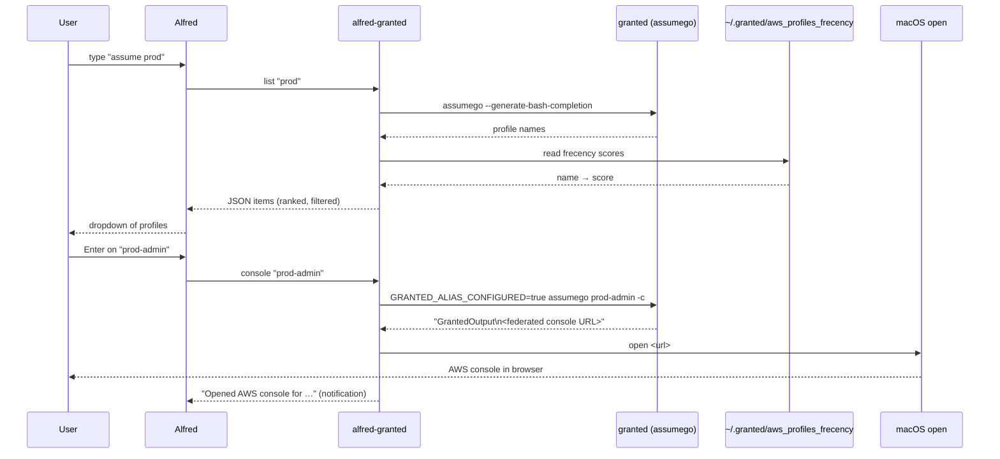

# Architecture

## Overview

The workflow is a single Rust binary, `alfred-granted`, with two subcommands
that map to the two objects in the Alfred workflow graph:

| Subcommand                    | Alfred object                    | Responsibility                                              |
| ----------------------------- | -------------------------------- | ----------------------------------------------------------- |
| `alfred-granted list [query]` | Script Filter (`input.scriptfilter`) | Print matching AWS profiles as Alfred JSON.             |
| `alfred-granted console <profile>` | Run Script (`action.script`)  | Resolve the console URL and open it in the browser.     |

Alfred invokes `list` on every keystroke and `console` once, when the user hits
<kbd>Enter</kbd> on a result.

## Data flow



## Module layout

```
src/
├── main.rs      Entry point: parse argv, dispatch to `list` / `console`.
├── lib.rs       Library root, re-exports the modules below.
├── runner.rs    CommandRunner trait + SystemRunner (the only impure boundary).
├── profiles.rs  Fetch (via assumego), rank (frecency), filter (substring).
├── frecency.rs  Parse ~/.granted/aws_profiles_frecency into name → score.
├── alfred.rs    Turn profile names into powerpack `Item`s.
└── console.rs   Resolve the console URL and open it.
```

## Design decisions

### Profiles come from granted, not from parsing `~/.aws/config`

`FORCE_NO_ALIAS=true assumego --generate-bash-completion` is exactly what
granted's own zsh completion calls. Reusing it means the workflow always sees
the same profile set as the native `assume` command — including profiles from
SSO sessions and profile registries — with zero config-parsing logic to keep in
sync with granted's behaviour.

### Frecency ranking

granted records usage frequency and recency per profile in
`~/.granted/aws_profiles_frecency`. We parse the `FrecencySortingScore` and sort
profiles by it (descending). Profiles that were never assumed have no score and
sink below the ones that were, keeping their original (alphabetical) order.
Frecency is best-effort: a missing or malformed file simply yields no scores and
the list falls back to alphabetical order — it never breaks listing.

### Opening the console ourselves

granted can open the browser itself, but its behaviour depends on the user's
`DefaultBrowser` setting — which may be `STDOUT` (print the URL instead of
opening it). To be robust regardless of that setting, we run `assumego -c` with
`GRANTED_ALIAS_CONFIGURED=true` — the same environment granted's `assume` shell
wrapper sets — so `assumego` prints its structured output (`GrantedOutput`
followed by the federated URL) to stdout. We extract that URL and call macOS
`open` ourselves, making the Enter action deterministic.

Note the environment difference between the two paths: listing uses
`FORCE_NO_ALIAS=true` (we only want completion output), while the console path
uses `GRANTED_ALIAS_CONFIGURED=true` (we need the wrapper-style structured
output that carries the URL).

### Substring filtering in Rust

The Script Filter sets `alfredfiltersresults = false`, so Alfred does not filter
results. We filter in Rust: a profile is kept only if it contains every
whitespace-separated term of the query as a case-insensitive substring (so
`sandbox admin` matches profiles containing both). This is more predictable than
fuzzy matching. Just as importantly, we **preserve the frecency order** of the
survivors, and do not set a `uid` on items — otherwise Alfred would re-sort by
its own usage knowledge and override our ranking. Items also carry an
`autocomplete` value so <kbd>Tab</kbd> completes the query to the profile name.

### The `CommandRunner` boundary

Every external process (`assumego`, `open`) goes through the `CommandRunner`
trait. Production uses `SystemRunner`; tests inject a `FakeRunner` that returns
canned output and records invocations. Everything else — parsing, ranking,
filtering, URL extraction — is pure and unit-tested offline. This keeps the test
suite fast and independent of any AWS/granted setup.
