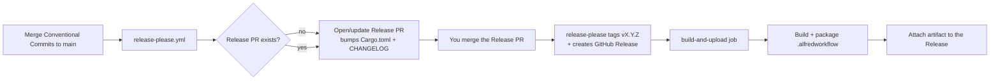

# Release process

Releases are automated with
[release-please](https://github.com/googleapis/release-please) and GitHub
Actions. You never bump the version or write the changelog by hand.

## How it works

1. **Land changes** on `main` using
   [Conventional Commits](https://www.conventionalcommits.org/) (`feat:`,
   `fix:`, `chore:`, …). The commit types drive the version bump:
   - `fix:` → patch
   - `feat:` → minor
   - `feat!:` / `BREAKING CHANGE:` → major (pre-1.0, a breaking change bumps
     the minor — see `bump-minor-pre-major` in `release-please-config.json`).
2. **release-please** (`.github/workflows/release-please.yml`) opens or updates
   a "Release PR" that bumps the version in `Cargo.toml` / `Cargo.lock` and
   updates `CHANGELOG.md`.
3. **Merge the Release PR** when you're ready to ship. release-please then:
   - creates the git tag `vX.Y.Z`,
   - creates the corresponding GitHub Release.
4. The **`build-and-upload` job** kicks in (guarded by
   `release_created == 'true'`), runs `./scripts/build.sh` on a macOS runner,
   and attaches `alfred-granted.alfredworkflow` to the Release.

Users then download that `.alfredworkflow` from the Releases page and
double-click to install.

## Version sources of truth

- `Cargo.toml` `version` — bumped by release-please.
- `.release-please-manifest.json` — release-please's record of the last released
  version. Do not edit by hand.
- `workflow/info.plist` `<version>` — synced from `Cargo.toml` by
  `scripts/build.sh` at build time, so the packaged artifact always carries the
  released version.

## Configuration

- `release-please-config.json` — `release-type: rust` so release-please knows to
  update `Cargo.toml`/`Cargo.lock`. `include-component-in-tag: false` produces
  plain `vX.Y.Z` tags.
- `.release-please-manifest.json` — current released version per package.

## CI

`.github/workflows/ci.yml` runs on every push and pull request: `fmt --check`,
`clippy -D warnings`, `cargo test`, a release build, and a packaging smoke test
that uploads the `.alfredworkflow` as a build artifact (not a release asset).

## Notes / caveats

- The pipeline uses the default `GITHUB_TOKEN`. Release PRs opened with this
  token do **not** trigger other workflows (a GitHub safety measure), so CI does
  not run on the Release PR itself. If you want CI on Release PRs, provide a
  Personal Access Token as a secret and pass it to the release-please action.
- The release artifact is an **arm64** (Apple Silicon) binary, matching the
  supported platform. To also ship Intel, add an `x86_64-apple-darwin` build and
  `lipo` the two into a universal binary before packaging.
- The macOS runner is Apple Silicon (`macos-latest` → macos-14+), so the built
  binary is arm64 without extra configuration.
